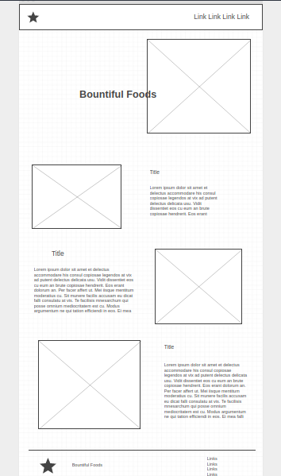

# Website Planning Document

Bountiful Foods

## Purpose

- Advertise our products.
- Provide recipes.
- Serve as a collection of links.
- Save extra recipes.

## Target Audience

- John
  - Average person
  - Likes fresh and local products
  - Needs a simple fruit drink recipes
  - Uses the website to look up recipes
- Jane
  - Likes making fun drinks
  - Wants a way to share them
  - Uses the website to share recipes

## Site Map

- Home (/) *Advertise products*
- Recipes (/recipes) *View our recipes*
- Socials (/socials) *Serve socials*
- Fresh (/fresh) *Create a custom recipe (using a form or through query parameters)*
- About Us (/about) *Show about us*

## Colors

    rgb(224, 230, 230)

    rgb(236, 222, 195)

    rgb(253, 134, 100)

    rgb(250, 190, 14)

    rgb(138, 182, 97)

## Typography

- Headers: [Solway](https://fonts.google.com/specimen/Solway)
- Main Content: [Open Sans](https://fonts.google.com/specimen/Open+Sans)

## Wireframes

